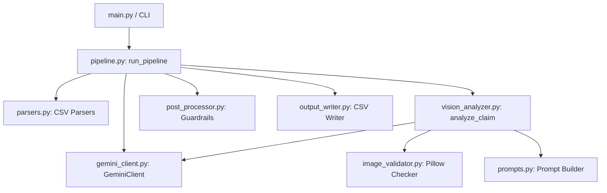

# SDK Migration Report: Multi-Modal Evidence Review System

This report document contains the Phase 1 Codebase Audit for migrating the hackathon codebase into a reusable developer SDK.

---

## 1. Project Overview

### What problem does the system solve?
The system automates the verification of visual and contextual evidence for multi-modal damage claims (for objects like cars, laptops, and packages). It validates whether submitted image evidence supports, contradicts, or lacks sufficient information to verify a user's damage claim.

### What are the major workflows?
1. **Claim Processing Workflow (Run Pipeline):**
   * Parses the input claim details (user conversation, claim object type, and image paths).
   * Resolves user claim history and minimum image requirements.
   * Performs pre-flight checks on images (existence, format, size, Pillow readability) to avoid wasting API tokens.
   * Prompts Gemini with a system prompt (Direct or Few-Shot) alongside the conversation context, requirements, and loaded images.
   * Validates and clamps Gemini's structured JSON output to the allowed enum schemas.
   * Applies post-processing business guardrails (e.g., forcing `not_enough_information` if the evidence standard is not met).
   * Writes the validated outputs to a structured CSV file.
2. **Evaluation Workflow:**
   * Runs the claim processing pipeline against labeled ground truth (`sample_claims.csv`).
   * Computes per-field exact-match accuracy, Jaccard similarity for multi-value set fields (risk flags, supporting images), and breakdown by object type.
   * Compares prompt strategies (Direct vs. Few-Shot) to determine the best performing strategy.

### How does data move through the system?
```
[Input CSV / Raw Inputs] ──► parse_claims() ──► ClaimInput (Pydantic Model)
                                                 │
                                                 ▼
[Local Image Assets] ──────► validate_claim_images() (Pillow verify)
                                                 │
                                                 ▼
[Gemini Vision API] ───────► analyze_claim() (Multimodal GenAI payload)
                                                 │
                                                 ▼
[Post-Processing] ─────────► merge_risk_flags() & apply_decision_guardrails()
                                                 │
                                                 ▼
[Final Output] ────────────► ClaimOutput ──► write_output_csv()
```

---

## 2. Module Inventory

| Module / File | Purpose | Key Dependencies |
| --- | --- | --- |
| `main.py` | CLI entry point for running the pipeline on claims CSVs. | `argparse`, `asyncio`, `config`, `pipeline` |
| `config.py` | Environment loading and global path/retry definitions. | `dotenv`, `pathlib`, `os` |
| `models.py` | Pydantic data schemas, enums, and allowed values. | `pydantic`, `enum`, `typing` |
| `parsers.py` | Parser functions for claims, history, and requirements CSVs. | `csv`, `pathlib`, `models` |
| `prompts.py` | Prompt templates (Direct/Few-Shot) and prompt text builder. | `models` |
| `image_validator.py` | pillow-based checks, byte-loading, and MIME resolution. | `PIL`, `pathlib`, `config` |
| `gemini_client.py` | genai SDK wrapper with concurrency limits and backoff. | `google.genai`, `asyncio`, `config` |
| `vision_analyzer.py` | Direct orchestration of prompt building & Gemini calling. | `models`, `gemini_client`, `image_validator`, `prompts`, `parsers` |
| `post_processor.py` | Applies business rules, risk flag merging, and overrides. | `models` |
| `output_writer.py` | DictWriter wrapper validating column orders and data values. | `csv`, `pathlib`, `models` |
| `pipeline.py` | Async task coordinator orchestrating flow across claims. | `asyncio`, `tqdm`, `config`, `parsers`, `vision_analyzer`, `post_processor`, `output_writer` |
| `evaluation/main.py` | Main script evaluating sample claims and comparing strategies. | `argparse`, `asyncio`, `config`, `pipeline`, `evaluation.metrics` |
| `evaluation/metrics.py` | Calculates exact matches and Jaccard similarity metrics. | None |

---

## 3. Architecture Analysis

### Current Architecture Description
The system is structured as a **procedural data pipeline** wrapped with Pydantic models for type safety. The pipeline coordinates data retrieval, pre-flight checks, API execution, business rule post-processing, and output writing in a serial-within-async-concurrency layout.

### Logical Component Diagram


### Coupling Issues
1. **Tight Coupling to File I/O:** Core functions (`analyze_claim`, `run_pipeline`) expect file paths and CSV databases. They cannot be executed purely in-memory (e.g. using list of dicts or memory streams).
2. **Global Config Dependency:** Almost all modules import from `config.py`, which triggers disk search for `.env` files and uses global constants like `GOOGLE_API_KEY`.
3. **Hardcoded Dataset Structure:** Image paths in claims are assumed to be relative to `dataset/images/` via path resolutions in `config.py` and `image_validator.py`.
4. **SDK Client Instantiation:** The LLM client lifecycle is tightly coupled to the pipeline.

---

## 4. Reusable Component Discovery

*   **Retrieval Engine:** The parsing logic in `parsers.py` (which matches claims to applicable evidence requirements and user history).
*   **Evidence Ranking Engine:** The core filtering/clamping of Gemini responses in `vision_analyzer.py` and identification of `supporting_image_ids` along with severity estimation.
*   **Claim Verification Engine:** The async claim analysis coordinator (`vision_analyzer.py:analyze_claim` and `post_processor.py:apply_decision_guardrails`).
*   **Multimodal Processing Pipeline:** The concurrent orchestrator in `pipeline.py:process_single_claim`.
*   **Embedding/Search Components:** Not currently present. Must design extensible hooks for embedding-based retrieval or visual search under the `embeddings` module.
*   **Utility Modules:** `image_validator.py` (local pre-flight verification to save API cost).

---

## 5. Public API Candidates

We recommend exporting the following high-level interfaces from the root of the SDK:

1.  **`verify_claim(claim_text, images, claim_object, history=None, requirements=None, ...)`**: High-level convenience entry point that performs the entire workflow for a single claim.
2.  **`retrieve_evidence(claim_object, issue_family)`**: Resolves the minimum evidence requirements from configured standards.
3.  **`rank_evidence(claim_input, analysis_result)`**: Filters, ranks, and overrides verification outputs using local business rules.
4.  **`MultimodalPipeline`**: Class that manages client sessions, concurrency limits, and batches verification of claims.
5.  **`GeminiClient`**: The underlying GenAI wrapper with robust retries, rate limits, and token tracking.

---

## 6. Package Readiness Assessment

### Application-Specific / Non-SDK Code
*   `code/main.py`: Specific CLI for the hackathon CSV schema.
*   `code/evaluation/`: Evaluation scripts.
*   `output_writer.py`: Formats specifically for outputting to 14-column CSV tables.

### Hardcoded Paths & Configuration Issues
*   `config.py` hardcodes:
    *   `PROJECT_ROOT = Path(__file__).parent.parent`
    *   `DATASET_DIR = PROJECT_ROOT / "dataset"`
    *   `IMAGES_DIR = DATASET_DIR / "images"`
*   `image_validator.py` resolves image paths strictly relative to `DATASET_DIR`.
*   Environment variables are loaded automatically from a hardcoded `code/.env` file.

### Refactoring Requirements
*   **Decouple File I/O:** Allow raw image bytes or file-like objects to be passed to validation and client wrappers.
*   **Inject Configurations:** Pass model name, API key, concurrency limits, and image paths dynamically via settings classes or init arguments instead of `config.py` globals.
*   **Abstract Image Loading:** Build a generic image reader interface supporting both local filesystem and in-memory byte inputs.
